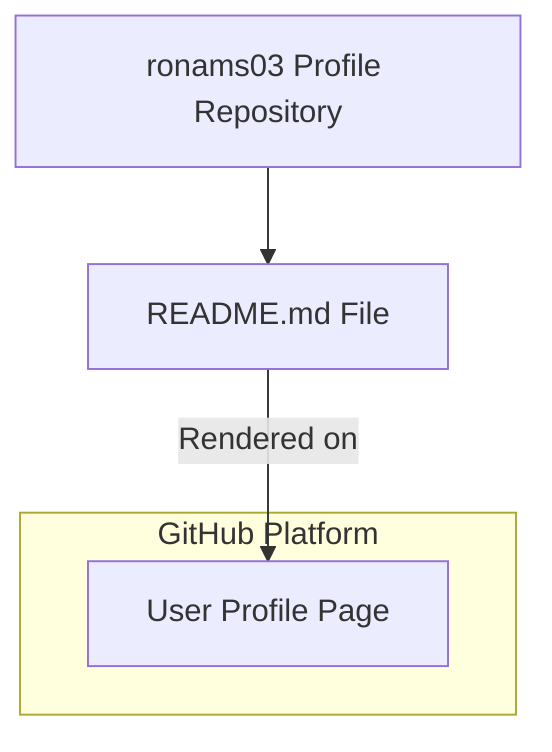

# 1 Repository Purpose & How It Works

## 1.1 GitHub Profile Rendering Model and Repository Contract

### Overview

The ronams03/ronams03 repository is a GitHub **profile repository** whose sole purpose is to power the user’s public profile page. By naming the repository exactly after the GitHub username, GitHub automatically renders its README.md at the top of the profile. This enables a fully customizable landing page—showcasing statistics, badges, social links, and a curated “Languages and Tools” wall—without any application code, build system, or CI/CD configuration.

### Rendering Model

- Repository Name Must Match Username

GitHub recognizes a repository named `<username>/<username>` and treats its README.md as the profile homepage.

- Single Source of Truth

All profile content is authored in README.md; no other files influence what is rendered.

- Live Rendering

Changes to README.md are reflected immediately on the profile once pushed, subject to GitHub’s Markdown/HTML renderer.



### Repository Contract

To maintain a consistent, error-free profile, this contract must be honored:

- Only README.md and LICENSE exist at the repository root. Any additional files are neither rendered nor necessary.
- Treat README.md as the live “view” layer. All layout, widget embeds, and content updates occur here.
- Preserve valid Markdown and HTML. Misnested tags or missing closing elements can break embeds—e.g., the icon wall uses `<div align="left">` and `` tags for DevIcons.
- Never rename or relocate README.md; GitHub’s rendering is filename-dependent.

### README.md Structure and Formatting

- Centered Statistics Widgets:

```html
  <div align="center">
    
    
  </div>
```

- Personal Greeting and Bio:

```html
  <h1 align="center">Hi 👋, I’m Roberth Namoc</h1>
  <h3 align="center">A passionate frontend developer...</h3>
```

- Icon Wall: Inline `` badges for JavaScript, TypeScript, React, etc.
- Social Badges and Support Buttons: Shields.io badges and BuyMeACoffee/Ko-fi embeds.

### Maintenance and Change Review

- Preview on GitHub after each push to confirm widget alignment, image loading, and Markdown parsing.
- Use GitHub’s built-in Markdown linter or a third-party previewer to catch HTML syntax errors.
- When adding new embeds, verify URL parameters (theme, locale, dimensions) to avoid broken images.
- Conduct peer reviews via pull requests for significant layout changes, ensuring that the profile remains cohesive and visually appealing.

---

**Repository Contents**

- LICENSE (MIT)
- README.md (Profile content)