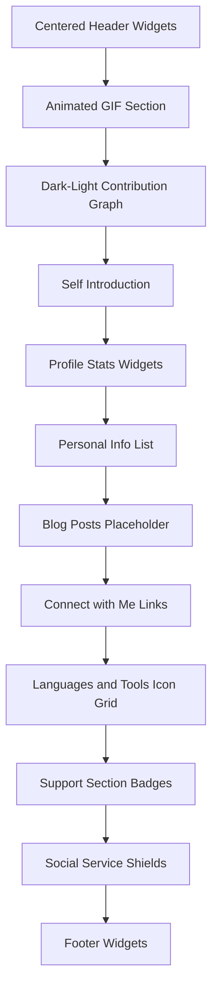

# 1) Repository Purpose & How It Works (GitHub Profile README)

This section describes how the `README.md` in the `ronams03/ronams03` profile repository assembles and lays out content on the GitHub profile page. The file leverages a mixture of Markdown headings and raw HTML blocks to embed external widgets, present personal branding, and showcase technologies and social links in a custom layout.

## 1.2 README Content Architecture

The `README.md` is organized into a linear sequence of visually distinct sections. It relies on HTML containers (`<div>`, `<p>`, `<picture>`) intermixed with Markdown separators (`###`, `######`) to control alignment, wrapping, and responsive widget rendering.

### Section Flow Diagram



### 1.2.1 Centered Header Widgets

- Wraps two key GitHub-stats widgets in a single container:

```html
  <div align="center">
    
    
  </div>
```

- Uses `align="center"` to horizontally center both images .

### 1.2.2 Animated GIF Section

- A Markdown heading separator (`###`) is immediately followed by a right-aligned GIF:

```html
  
```

- Placed without surrounding block elements to float the GIF alongside subsequent content .

### 1.2.3 Dark-Light Mode Contribution Graph

- Uses a `<picture>` element with two `<source>` tags to switch between dark- and light-mode SVGs, falling back to an `` if necessary:

```html
  <picture>
    <source media="(prefers-color-scheme: dark)" srcset="…-dark.svg">
    <source media="(prefers-color-scheme: light)" srcset="….svg">
    
  </picture>
```

- Preceded by another `###` separator to create vertical spacing .

### 1.2.4 Self Introduction

- Centered heading and subheading introduce the profile owner:

```html
  <h1 align="center">Hi 👋, I'm ROBERTH NAMOC</h1>
  <h3 align="center">A passionate frontend developer from Cagayan de Oro City, Philippines</h3>
```

- Both headings use `align="center"` to maintain visual hierarchy .

### 1.2.5 Profile Stats Widgets

- A trio of left-aligned `<p>` blocks display:- Profile-view counter
- GitHub-profile-trophy badge
- Twitter follow badge

```html
  <p align="left">
    
  </p>
  <p align="left">
    <a href="https://github.com/ryo-ma/github-profile-trophy">
      
    </a>
  </p>
  <p align="left">
    <a href="https://twitter.com/…">
      
    </a>
  </p>
```

### 1.2.6 Personal Info List

- A Markdown bulleted list follows, detailing:- Current projects
- Learning focus
- Team preferences
- All projects link
- Contact email
- Resume link
- Fun fact

```md
  - 🔭 I’m currently working on [Many project ideas](…)
  - 🌱 I’m currently learning **Everything about Programming Language**
  - 👯 I Love Team Working [--](--)
  - 🤝 I’m a Vibe Coders [--](--)
  - 👨💻 All of my projects are available at [github.com/ronams03](…)
  - 💬 Ask me about **anything**
  - 📫 How to reach me **kristinedais10@gmail.com**
  - 📄 Know about my experiences [based on my knowledge](…)
  - ⚡ Fun fact **Vibe Coders**
```

### 1.2.7 Blog Posts Placeholder

- A section header and HTML comments reserve space for automated blog-post insertion:

```md
  ### Blogs posts
  <!-- BLOG-POST-LIST:START -->
  <!-- BLOG-POST-LIST:END -->
```

### 1.2.8 Connect with Me Links

- A left-aligned heading followed by social icons for Dev.to and Twitter:

```html
  <h3 align="left">Connect with me:</h3>
  <p align="left">
    <a href="https://dev.to/dev.quadratic03" target="blank">
      
    </a>
    <a href="https://twitter.com/…">
      
    </a>
  </p>
```

### 1.2.9 Languages and Tools Icon Grid

- A left-aligned heading introduces a large grid of technology logos, each wrapped in an `<a>` linking to its official site:

```html
  <h3 align="left">Languages and Tools:</h3>
  <p align="left">
    <a href="https://developer.android.com" target="_blank" rel="noreferrer">
      
    </a>
    <!-- dozens more icons for Swift, Unity, React, NodeJS, etc. -->
  </p>
```

- Relies on uniform `width="40" height="40"` attributes and HTML inline spacing to wrap icons into rows .

### 1.2.10 Support Section

- A left-aligned heading followed by donation-button badges for BuyMeACoffee and Ko-fi, then two `<br>` tags for spacing:

```html
  <h3 align="left">Support:</h3>
  <p>
    <a href="https://www.buymeacoffee.com/…">
      
    </a>
    <a href="https://ko-fi.com/…">
      
    </a>
  </p>
  <br><br>
```

### 1.2.11 Social Service Shields

- A secondary `<div align="left">` presents branded social badges via Shields.io (YouTube, Instagram, Twitch, Discord, Gmail, LinkedIn):

```html
  <div align="left">
    
    <!-- other Shields badges -->
  </div>
```

### 1.2.12 Footer Widgets

- A `<br clear="both">` resets float positioning, then a centered block shows:- Daily streak stats
- GitHub-profile trophies
- Finally another `<picture>`-based contribution graph for dark/light modes

```html
  <br clear="both">
  <div align="center">
    
    
  </div>
  <picture>…</picture>
```

---

Throughout, the `README.md` intermixes Markdown heading syntax (`###`, `######`) with raw HTML (`<div>`, ``, `<a>`, `<picture>`) and HTML comments for dynamic content injection. Correct nesting and spacing are critical: missing or misplaced line breaks, `<br>` tags, or `align` attributes can break floats, wrap behavior, or widget rendering in the final GitHub profile page.