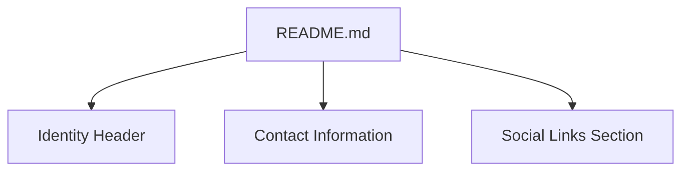

# Identity, Contact, and Social Links Maintenance Feature Documentation

## Overview

The Identity, Contact, and Social Links section of the GitHub Profile README is responsible for presenting the author’s personal branding and providing channels for connection. It displays the user’s name, a brief professional tagline, direct contact information, and a curated set of external profile links. Maintaining this section ensures visitors instantly recognize the profile owner and can reach out or follow on preferred platforms.

Within the `ronams03/ronams03` repository, this segment sits immediately after the visual stats widgets and precedes the “Languages and Tools” wall. It serves both a UX purpose—making the profile approachable—and a business purpose—facilitating networking, community engagement, and potential collaboration.

## Content Structure



### Identity Header (`README.md`)

Purpose and Responsibilities

- Introduce the profile owner by name and role/location.
- Establish immediate recognition and set context for the rest of the README.

Key Elements

| Element | Description |
| --- | --- |
| `<h1 align="center">` | “Hi 👋, I'm ROBERTH NAMOC” — the full display name with emoji greeting |
| `<h3 align="center">` | “A passionate frontend developer from Cagayan de Oro City, Philippines” — concise professional tagline |


### Contact Information (`README.md`)

Purpose and Responsibilities

- Offer a direct channel for reaching the author via email.
- Encourage one‐click correspondence.

Key Element

| Element | Description |
| --- | --- |
| `📫 How to reach me **kristinedais10@gmail.com**` | Plaintext email for direct contact |


### Social Links Section (`README.md`)

Purpose and Responsibilities

- Provide quick‐access icons linking to external platforms (e.g., Dev.to, Twitter).
- Drive followers and readers to community or professional networks.

Markup Example

```html
<h3 align="left">Connect with me:</h3>
<p align="left">
  <a href="https://dev.to/dev.quadratic03" target="blank">
    
  </a>
  <a href="https://twitter.com/roberthpendrin4" target="blank">
    
  </a>
</p>
```

| Platform | URL | Icon Source |
| --- | --- | --- |
| Dev.to | https://dev.to/dev.quadratic03 | GitHub-hosted SVG |
| Twitter | https://twitter.com/roberthpendrin4 | GitHub-hosted SVG |


## Maintenance Guidelines

- **Link Validation**: Regularly run an automated link checker (e.g., [markdown-link-check]) to detect broken or redirected URLs.
- **Consistent Attributes**: Update all external anchors to use

```html
  target="_blank" rel="noreferrer"
```

ensuring links open in new tabs and omit referrer headers.

- **Email Exposure**: Consider replacing plaintext email with a `mailto:` link (`<a href="mailto:kristinedais10@gmail.com">…</a>`) to improve clickability and optionally obfuscate the address.
- **Accessibility**: Maintain descriptive `alt` attributes on all icon images and uniform sizing via `height`/`width` attributes.
- **Change Process**: When updating any link or identifier, commit the change in a pull request and preview the README in GitHub to confirm correct rendering and link behavior.

## Key Links Reference

| Link Type | Selector / Snippet | Value / URL |
| --- | --- | --- |
| Display Name | `<h1 align="center">` | Hi 👋, I'm ROBERTH NAMOC |
| Tagline | `<h3 align="center">` | A passionate frontend developer from Cagayan… |
| Contact Email | Plaintext after “📫” | kristinedais10@gmail.com |
| Dev.to Profile | `<a href="https://dev.to/dev.quadratic03">` | https://dev.to/dev.quadratic03 |
| Twitter Profile | `<a href="https://twitter.com/roberthpendrin4">` | https://twitter.com/roberthpendrin4 |
