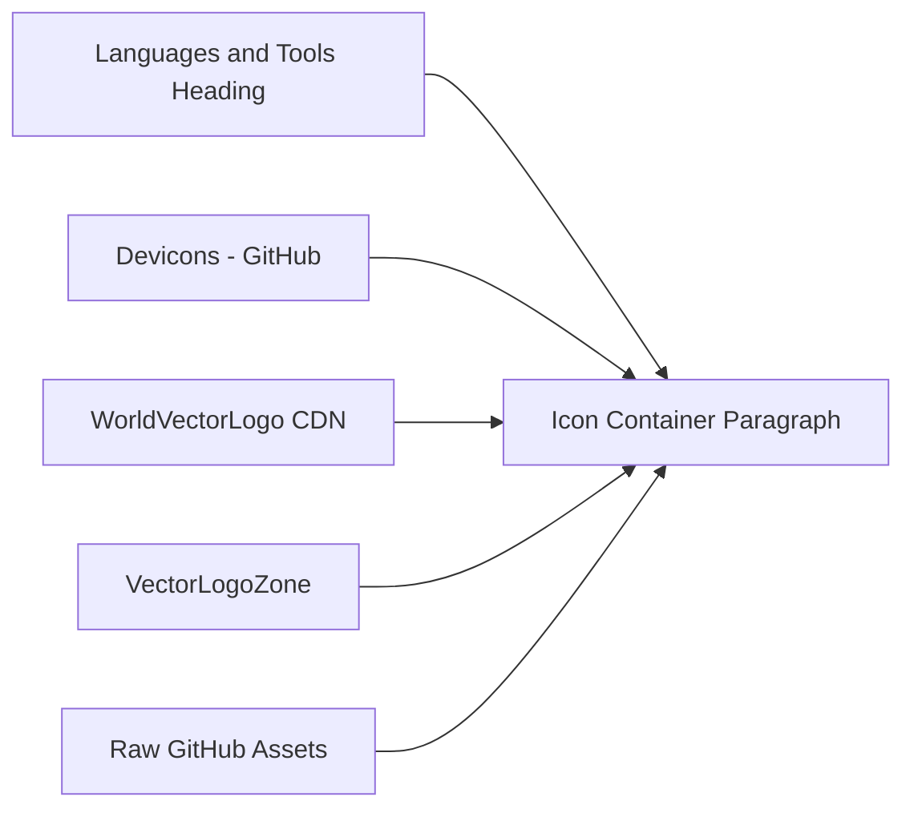

# Repository Purpose & How It Works (GitHub Profile README)

## 1.5 ‘Languages and Tools’ Icon Wall: Source URLs, Consistency, and Curation

### Overview

The **Languages and Tools** section of the profile README presents a visually engaging icon wall that showcases the programming languages, frameworks, libraries, and tools the developer uses. Each icon is clickable, linking to the official website of the technology. This wall provides immediate visual context for visitors to quickly recognize competencies and explore further.

### Structure

The icon wall is implemented with a third-level heading and a left-aligned paragraph containing a sequence of anchor (`<a>`) elements, each wrapping an image (``) tag. For example:

```html
<h3 align="left">Languages and Tools:</h3>
<p align="left">
  <a href="https://developer.android.com" target="_blank" rel="noreferrer">
    
  </a>
  <!-- additional icons follow the same pattern -->
</p>
```

This pattern repeats to list all assets in the wall .

### Asset Sources

Icons are pulled from several public repositories and CDNs to leverage existing brand assets:

- **Devicons (GitHub)**

raw.githubusercontent.com/devicons/devicon/master/icons/…

- **WorldVectorLogo CDN**

cdn.worldvectorlogo.com/logos/…

- **VectorLogo Zone**

www.vectorlogo.zone/logos/…

- **Official Project Domains**

e.g., download.blender.org/branding/…

- **SVGRepo**

www.svgrepo.com/show/…

### Sizing Conventions

- All icons in this wall use `width="40"` and `height="40"` to enforce a uniform square grid regardless of the source asset’s native dimensions.
- The surrounding `<p>` tag uses `align="left"` so icons flow horizontally and wrap naturally.

### Addition & Removal Workflow

To **add** a new technology:

1. Copy the `<a>`…`</a>` block and update:- `href` to the technology’s official URL.
- `src` to point at a reliable SVG asset URL.
- `alt` to the tech’s lowercase name.
2. Ensure `width="40"` and `height="40"` attributes are set.

To **remove** a technology:

- Delete its corresponding `<a>`…`</a>` element from the `<p>` container.

### Common Failure Modes

- **Dead URLs**: Upstream asset reorganizations or deletions lead to broken images.
- **Mixed Styles**: Variation between wordmarks, line icons, and full-color logos causes inconsistent visual weight.
- **Aspect-Ratio Mismatch**: Non-square SVG viewports can render uneven padding or alignment.
- **CDN Downtime**: Reliance on multiple external CDNs increases overall risk of unavailable assets.

### Curation & Consistency Guidelines

- Icons are manually ordered to group related technologies (platforms → design tools → languages → frameworks → databases → dev tools).
- Alt text uses the plain lowercase name (e.g., `"reactnative"`).
- Uniform sizing (40×40) ensures a tidy grid regardless of inherent SVG dimensions.
- Asset sources are chosen based on reliability and official branding availability.

### Icon Wall Asset Workflow



This flowchart illustrates how multiple external asset sources feed into a single `<p>` container in the README, rendering the comprehensive icon wall.