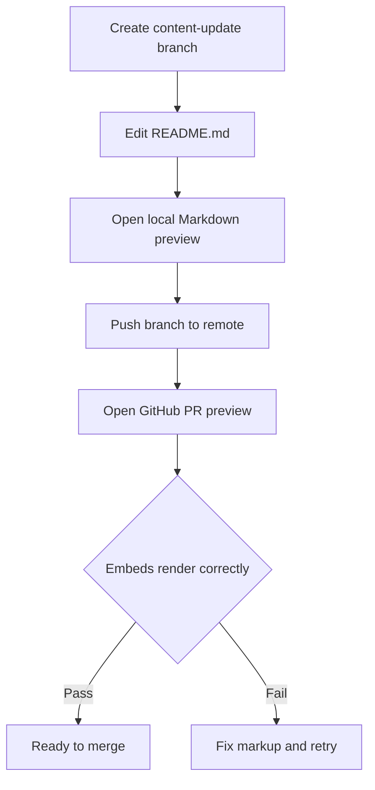

# 2 Content Update Runbook (Maintaining the Profile README)

## 2.1 Safe Editing Workflow and Rendering Validation

This section defines the internal runbook for making safe, incremental changes to the `README.md` in the `ronams03/ronams03` repository. It covers syntax guidelines for mixed Markdown and HTML, methods to preview on GitHub, and a detailed checklist to verify that all embedded graphs, badges, and images render as expected.

### 2.1.1 Editing Guidelines

#### 2.1.1.1 Markdown vs. HTML Usage

- Favor native Markdown for headings, lists, links, emphasis, and code blocks.
- Use inline HTML only for alignment and complex embeds (e.g., `<div align="center">`, `<picture>`). Ensure every tag is properly opened and closed and that attributes are quoted.
- Example: the top-center stats section uses

```html
  <div align="center">
    
  </div>
```

#### 2.1.1.2 External Widget and Badge Management

- **Stats & Languages Charts**- Update the `username` parameter in the URL to `ronams03` for both the commits graph and top-langs chart .
- **Badge Wall (“Languages and Tools”)**- Each `<a>` tag wraps an `` at 40×40 px with accurate `alt` text. Confirm that the source URL and `rel="noreferrer"` attributes are correct .
- **Social Links**- Under “Connect with me,” each `<a>` must include `target="_blank" rel="noreferrer"`. Verify that clicking an icon opens the correct external profile in a new tab .
- **Theme-Aware Images**- If using `<picture>`, provide both dark/light `srcset` variants and proper `media` queries to avoid broken images.

### 2.1.2 Previewing Changes

Before merging, render and inspect the updated README through multiple lenses:

1. **Local Editor Preview**- Open `README.md` in VS Code (or equivalent) and launch the built-in Markdown preview.
2. **GitHub UI Preview**- Push your branch and create a draft pull request. On the PR page, select the “Files changed” tab and click “View file” to see the live render.
3. **External Widgets Load Test**- While previewing, ensure that each external `` (stats graph, streak, trophies) fetches successfully. Note that offline/local previews may not display real-time graphs—always validate on GitHub.



```card
{
    "title": "Tip",
    "content": "Use a link-checker tool (e.g., markdown-link-check) to automate detection of broken URLs in badges and anchors."
}
```

### 2.1.3 Rendering Validation Checklist

- [ ] **Stats Graph**: Displays total commits, rank, and icons without errors.
- [ ] **Top Languages Chart**: Reflects correct language breakdown.
- [ ] **Right-Aligned GIF**: Loads and maintains the intended size and position.
- [ ] **Badge Wall**: All icons (40×40 px) appear with matching `alt` text.
- [ ] **Social Links**: Icons load, `target`/`rel` attributes are present, and links open externally.
- [ ] **Theme-Aware Images**: Dark/light SVG alternates load via `<picture>` (if used).
- [ ] **HTML Tag Integrity**: No unclosed tags or malformed attributes in `<div>`, `<h3>`, `<p>`, etc.
- [ ] **Link Validity**: No HTTP 404s or broken references in any `<a>` or `` URLs.

---

Making changes to the profile README safe and consistent ensures that all statistics, badges, and social widgets remain fully functional and visually aligned across light/dark themes and different rendering contexts.