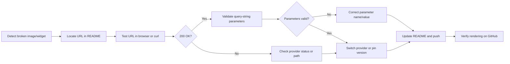

# 2) Content Update Runbook (Maintaining the Profile README)

## 2.2 Troubleshooting Broken Images/Widgets and Link Rot

### Overview

Over time, external image and widget URLs embedded in your profile README may break or change, leading to missing badges, blank icons, or 404 errors. Link rot occurs when a resource you rely on is moved or removed. This section describes how to systematically diagnose broken assets and restore full functionality, ensuring your README always renders correctly.

---

### 2.2.1 Diagnosis Process

1. **Visual Inspection**- Open your GitHub profile page and look for missing icons, blank placeholders, or broken `` tags.
2. **Browser Console & Network Panel**- Press F12 → **Console**: look for CORS or 404 errors pointing to specific URLs.
- Switch to **Network** tab and reload; filter by “img” or “XHR” to spot failing requests.
3. **Automated Link Checker**- Run a tool like `linkchecker` or `lychee` against your raw README URL to list all dead links in one report.

---

### 2.2.2 Verify Remote URLs

For each broken image or widget:

1. **Copy the URL** from the `src` attribute in your README.
2. **Test in isolation** by pasting into a browser or using `curl -I <URL>` to confirm a `200 OK` response.

Example: the React icon served from the Devicon CDN

```html
https://raw.githubusercontent.com/devicons/devicon/master/icons/react/react-original-wordmark.svg
```

If this returns 404 or times out, the path may have changed .

---

### 2.2.3 Validate Query-String Parameters

Dynamic widgets (GitHub stats, streaks, trophies) rely on query parameters. Ensure each parameter is spelled correctly and your username is accurate.

#### Common GitHub Stats Parameters

- `username`: your GitHub handle
- `hide_title`, `hide_rank`: boolean flags
- `show_icons`, `include_all_commits`, `count_private`, `disable_animations`: feature toggles
- `theme`: color theme (e.g., `dracula`)
- `locale`: language code (e.g., `en`)
- `hide_border`: boolean

Example URL from your README:

```html
https://github-readme-stats.vercel.app/api?
  username=ronams03&
  show_icons=true&
  include_all_commits=true&
  theme=dracula
```

Test this exact string as one line in the browser address bar to confirm it still returns an SVG .

---

### 2.2.4 Mitigation Strategies

#### 1. Pin Versions & Themes

- Lock your widget calls to a known-good theme or commit. For example, if Vercel’s GitHub-readme-stats API breaks a new theme, revert to a previously working theme value.

#### 2. Switch Providers

- If one service goes down, substitute with an alternative host:- Replace `raw.githubusercontent.com` Devicon URLs with `cdn.jsdelivr.net` mirrors.
- Swap `github-readme-streak-stats.herokuapp.com` for `streak-stats.demolab.com`.

#### 3. Host Locally (Optional)

To eliminate external dependencies entirely:

1. Download the SVG/PNG asset into your repository’s `/assets` folder.
2. Reference it relatively:

```markdown
   
```

1. Commit and push alongside your README.

---

### 2.2.5 Troubleshooting Flowchart



---

### 2.2.6 Example Walkthrough

**Scenario:** The React icon no longer appears next to “Languages and Tools.”

1. Inspect console → 404 for

`https://raw.githubusercontent.com/devicons/devicon/master/icons/react/react-original-wordmark.svg`

1. Paste URL into browser → confirms 404.
2. Visit Devicon repo directly → notice path changed to `react-original.svg`.
3. Update README to:

```html
   
```

1. Commit, push, and verify on profile page.

---

### 2.2.7 Key References

- Devicon SVGs: `https://raw.githubusercontent.com/devicons/devicon/master/icons/...`
- GitHub-readme-stats API: `https://github-readme-stats.vercel.app/api?...`
- Shields.io badges: `https://img.shields.io/...`

Use this runbook whenever updating or diagnosing your profile README to keep all images and widgets displaying correctly over time.